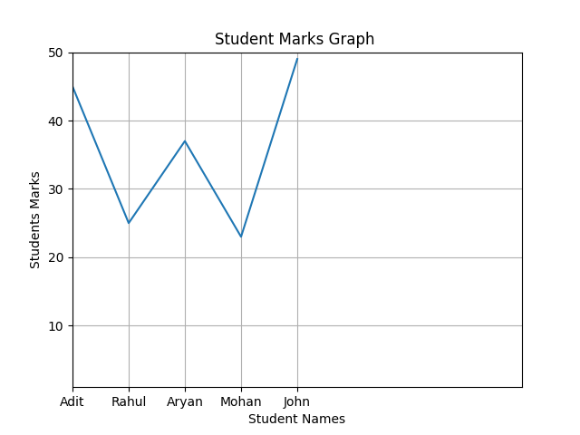

<h1>Phonenumber locator</h1>

using phonenumbers python library we can collect information regarding the specific phonenumber given by user like timezone,carrier(airtel ,vodafone)
and geocoder

  
  
<h2>Installation</h2>

<h3>pip install phonenumbers</h3>
  
<h4>import phonenumbers

from phonenumbers import timezone,geocoder,carrier</h4>

<h1>Leap Year</h1>

A leap year is exactly divisible by 4 except for century years (years ending with 00). The century year is a leap year only if it is perfectly divisible by 400.
 

<h1>Quiz game</h1>

Asking full form of basic computing terms and using knowledge of if-else statement we can get final score and %.By simply doing score = score+1 after every correct answer.Also ensured. if user input mix of small case,lower case value then used .lower() so whatever is typed is made equal to what we have given as answer in lower case if answer is right irrespective of letter is capital or not

 

<h1>Pycountry</h1>

Using this python module we can get the ISO data of any specific country using its code like its official name and flag etc.

<h1>Matplotlib</h1>

Created a students vs marks graph using this module
 

<h1>Turtle graphics</h1>

used inbuilt turtle library in python to create fun animations and graphics,in this i used basic while loop to continue the turtle animation and movement till loops break after the given condition, and also the basic forward movement of turtle and right angle direction to direct it and also used inbuilt pendown().Also filled color and background color as black.

